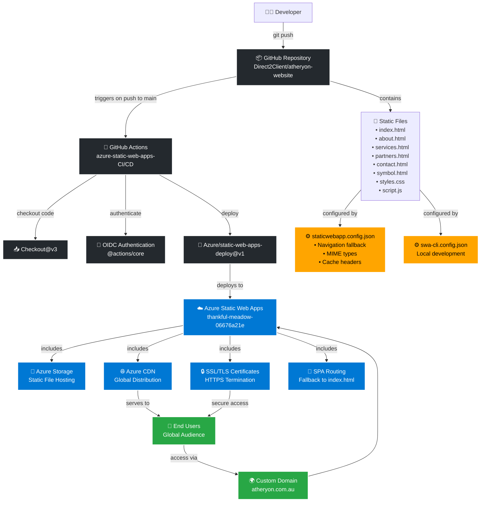

# Atheryon Website Architecture

This document provides a comprehensive overview of how the Atheryon website application works and the Azure components it uses.

## Architecture Diagram



## Component Details

### 1. GitHub Repository
- **Static HTML Website**: Pure HTML/CSS/JavaScript with no build process
- **Multi-page Structure**: Separate files for each section
- **Version Control**: Git-based with main branch as production

### 2. GitHub Actions CI/CD
- **Trigger**: Automatic on push to main branch or PR events
- **Authentication**: Uses OIDC (OpenID Connect) for secure Azure authentication
- **Deployment**: Uses Azure/static-web-apps-deploy@v1 action
- **Configuration**: 
  - `app_location: "/"` - Source code location
  - `output_location: "."` - Build output (same as source for static site)
  - `skip_app_build: true` - No build process required

### 3. Azure Static Web Apps
- **Hosting**: Serverless hosting for static web applications
- **Built-in Features**:
  - Global CDN distribution
  - SSL/TLS certificates (automatic HTTPS)
  - Custom domain support
  - SPA routing with fallback to index.html
  - Staging environments for pull requests

### 4. Configuration Files

#### staticwebapp.config.json
```json
{
  "navigationFallback": {
    "rewrite": "/index.html"  // SPA routing fallback
  },
  "mimeTypes": {             // File type configurations
    ".json": "application/json",
    ".html": "text/html",
    // ... other mime types
  },
  "globalHeaders": {
    "Cache-Control": "no-cache"  // Caching strategy
  }
}
```

#### swa-cli.config.json
```json
{
  "configurations": {
    "atheryon-website": {
      "appLocation": ".",      // Local development configuration
      "outputLocation": "."
    }
  }
}
```

## Deployment Flow

1. **Developer commits** code changes and pushes to main branch
2. **GitHub Actions triggers** the CI/CD workflow automatically
3. **Authentication** occurs via OIDC token exchange with Azure
4. **Static Web Apps Deploy** action uploads the static files to Azure
5. **Azure processes** the deployment and updates the live site
6. **CDN propagation** distributes the changes globally
7. **Users access** the updated site via HTTPS

## Local Development

```bash
# Using Azure Static Web Apps CLI
swa start . --port 4280

# Or using Python HTTP server
python3 -m http.server 8000
```

## Key Benefits

- **Zero Build Process**: Static files served directly
- **Global Performance**: Azure CDN ensures fast loading worldwide
- **Automatic HTTPS**: SSL certificates managed automatically
- **Staging Environments**: PR previews for testing changes
- **Cost Effective**: Pay-as-you-go pricing, often free for small sites
- **High Availability**: Azure's global infrastructure ensures uptime

## Security Features

- **HTTPS Everywhere**: Automatic SSL/TLS encryption
- **OIDC Authentication**: Secure CI/CD pipeline authentication
- **Branch Protection**: Only main branch deployments to production
- **Content Security**: Static files with no server-side vulnerabilities