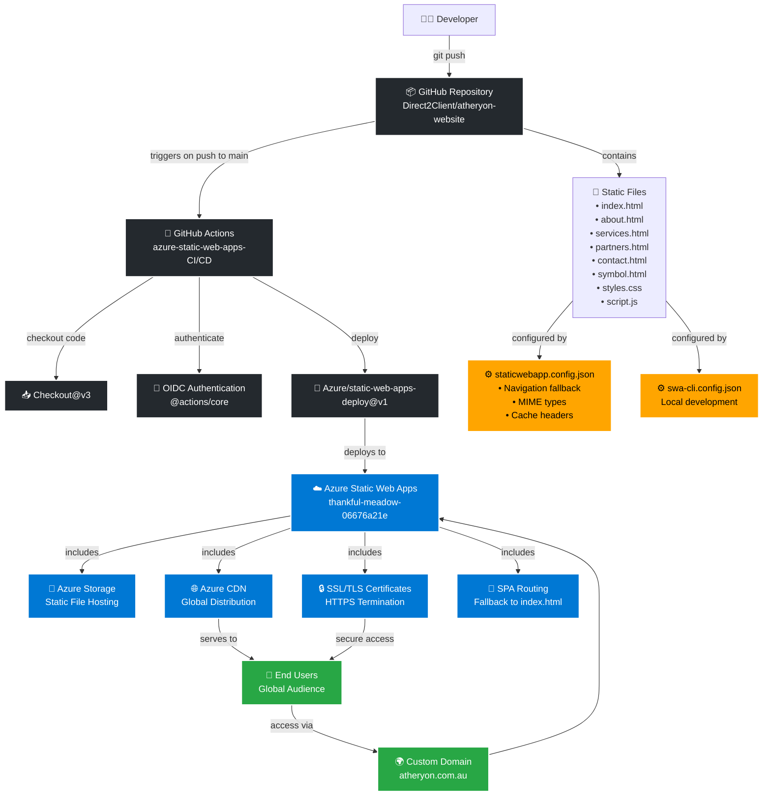

# Atheryon Website Architecture

This document provides a comprehensive overview of how the Atheryon website application works and the Azure components it uses.

## Architecture Diagram



## Component Details

### 1. GitHub Repository
- **Static HTML Website**: Pure HTML/CSS/JavaScript with no build process
- **Multi-page Structure**: Separate files for each section
- **Version Control**: Git-based with main branch as production

### 2. GitHub Actions CI/CD
- **Trigger**: Automatic on push to main branch or PR events
- **Authentication**: Uses OIDC (OpenID Connect) for secure Azure authentication
- **Deployment**: Uses Azure/static-web-apps-deploy@v1 action
- **Configuration**: 
  - `app_location: "/"` - Source code location
  - `output_location: "."` - Build output (same as source for static site)
  - `skip_app_build: true` - No build process required

### 3. Azure Static Web Apps
- **Hosting**: Serverless hosting for static web applications
- **Built-in Features**:
  - Global CDN distribution
  - SSL/TLS certificates (automatic HTTPS)
  - Custom domain support
  - SPA routing with fallback to index.html
  - Staging environments for pull requests

### 4. Configuration Files

#### staticwebapp.config.json
```json
{
  "navigationFallback": {
    "rewrite": "/index.html"  // SPA routing fallback
  },
  "mimeTypes": {             // File type configurations
    ".json": "application/json",
    ".html": "text/html",
    // ... other mime types
  },
  "globalHeaders": {
    "Cache-Control": "no-cache"  // Caching strategy
  }
}
```

#### swa-cli.config.json
```json
{
  "configurations": {
    "atheryon-website": {
      "appLocation": ".",      // Local development configuration
      "outputLocation": "."
    }
  }
}
```

## Deployment Flow

1. **Developer commits** code changes and pushes to main branch
2. **GitHub Actions triggers** the CI/CD workflow automatically
3. **Authentication** occurs via OIDC token exchange with Azure
4. **Static Web Apps Deploy** action uploads the static files to Azure
5. **Azure processes** the deployment and updates the live site
6. **CDN propagation** distributes the changes globally
7. **Users access** the updated site via HTTPS

## Local Development

```bash
# Using Azure Static Web Apps CLI
swa start . --port 4280

# Or using Python HTTP server
python3 -m http.server 8000
```

## Key Benefits

- **Zero Build Process**: Static files served directly
- **Global Performance**: Azure CDN ensures fast loading worldwide
- **Automatic HTTPS**: SSL certificates managed automatically
- **Staging Environments**: PR previews for testing changes
- **Cost Effective**: Pay-as-you-go pricing, often free for small sites
- **High Availability**: Azure's global infrastructure ensures uptime

## Security Features

- **HTTPS Everywhere**: Automatic SSL/TLS encryption
- **OIDC Authentication**: Secure CI/CD pipeline authentication
- **Branch Protection**: Only main branch deployments to production
- **Content Security**: Static files with no server-side vulnerabilities

## Network Information & Troubleshooting

### IP Address Information

#### Azure Static Web Apps IP Ranges
Azure Static Web Apps uses dynamic IP addresses that are part of Azure's global infrastructure. The service utilizes:

- **Azure CDN IP Ranges**: Dynamic IPs from Azure's CDN service
- **Regional Data Centers**: Multiple IP ranges across Azure regions
- **Outbound IPs**: Variable based on deployment region

To get current IP ranges:
```bash
# Download Azure IP ranges (updated weekly)
curl -O https://download.microsoft.com/download/7/1/D/71D86715-5596-4529-9B13-DA13A5DE5B63/ServiceTags_Public_20240101.json

# Filter for Static Web Apps service
grep -A 10 "AzureStaticWebApps" ServiceTags_Public_20240101.json
```

#### Common IP Ranges (Subject to Change)
- **Australia East**: 20.70.222.0/23, 40.82.252.0/22
- **Global CDN**: 13.107.42.0/24, 13.107.43.0/24
- **Edge Locations**: Distributed across 100+ Azure edge locations

### Diagnostic Information

#### Application Details
- **Static Web App Name**: `thankful-meadow-06676a21e`
- **Resource Group**: Auto-generated by Static Web Apps
- **Deployment Region**: Australia East (primary)
- **CDN Profile**: Managed by Azure Static Web Apps

#### Troubleshooting Commands

**Automated Diagnostics Script**:
```bash
# Run comprehensive network diagnostics
./network-diagnostics.sh
```

**Health Check URLs**:
```bash
# Main application health
curl -I https://thankful-meadow-06676a21e.1.azurestaticapps.net/

# Specific page health checks
curl -I https://thankful-meadow-06676a21e.1.azurestaticapps.net/about.html
curl -I https://thankful-meadow-06676a21e.1.azurestaticapps.net/services.html
```

**DNS Resolution**:
```bash
# Check DNS resolution
nslookup thankful-meadow-06676a21e.1.azurestaticapps.net

# Trace routing
traceroute thankful-meadow-06676a21e.1.azurestaticapps.net
```

#### Network Tracing Commands

**Check SSL/TLS Configuration**:
```bash
# SSL certificate details
openssl s_client -connect thankful-meadow-06676a21e.1.azurestaticapps.net:443

# Check SSL labs rating
curl -s "https://api.ssllabs.com/api/v3/analyze?host=thankful-meadow-06676a21e.1.azurestaticapps.net"
```

**Performance Testing**:
```bash
# Response time testing
curl -w "@curl-format.txt" -o /dev/null -s https://thankful-meadow-06676a21e.1.azurestaticapps.net/

# Where curl-format.txt contains:
#     time_namelookup:  %{time_namelookup}\n
#     time_connect:     %{time_connect}\n
#     time_appconnect:  %{time_appconnect}\n
#     time_pretransfer: %{time_pretransfer}\n
#     time_redirect:    %{time_redirect}\n
#     time_starttransfer: %{time_starttransfer}\n
#     time_total:       %{time_total}\n
```

### Monitoring & Logging

#### Azure Monitor Integration
- **Application Insights**: Available for advanced monitoring
- **Resource Logs**: Can be enabled in Azure portal
- **Metrics**: Request count, response time, error rates

#### Troubleshooting Common Issues

**1. Deployment Issues**:
```bash
# Check GitHub Actions logs
gh run list --repo Direct2Client/atheryon-website

# View specific workflow run
gh run view <run-id> --repo Direct2Client/atheryon-website
```

**2. DNS Issues**:
```bash
# Check if custom domain is properly configured
dig atheryon.com.au +short
dig www.atheryon.com.au +short
```

**3. CDN Cache Issues**:
```bash
# Force cache refresh with unique query parameter
curl -I "https://thankful-meadow-06676a21e.1.azurestaticapps.net/?t=$(date +%s)"
```

#### Support Information

**Azure Support Resources**:
- **Portal**: https://portal.azure.com
- **Resource ID**: `/subscriptions/{subscription-id}/resourceGroups/{resource-group}/providers/Microsoft.Web/staticSites/thankful-meadow-06676a21e`
- **Support Tickets**: Can be created through Azure portal
- **Documentation**: https://docs.microsoft.com/en-us/azure/static-web-apps/

**Contact Information for Issues**:
- **Technical Support**: Azure Support Portal
- **Billing Issues**: Azure Account Center
- **Service Health**: https://status.azure.com/